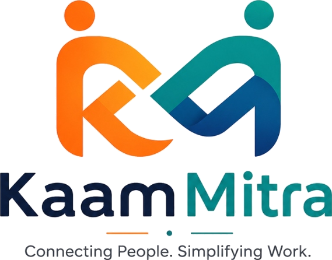

<div align="center">
  
</div>

# KaamMitra – Local Services Marketplace

KaamMitra is a voice-first local services marketplace tailored for Indian/Bharat users. It connects customers with verified nearby workers (Electrician, Plumber, Carpenter, etc.) without relying on middlemen.

## Technology Stack
- **Frontend**: React (Vite), Tailwind CSS, React Router, Lucide React (Icons), Web Speech API.
- **Backend**: Node.js, Express.js, JSON Web Tokens (JWT), bcrypt, Cloudinary (File Storage).
- **Database**: MongoDB Atlas (Mongoose) with GeoJSON geospatial indexing for location matching.
- **Deployment Ready**: Fully configured for serverless providers (e.g. Vercel/Render) and scalable deployments.

## Features Built in Phase 1 & 2
- **Dynamic City & Area Management**: Users can request area launches if their city is not yet supported.
- **Worker Verification & Onboarding**: Robust 3-step registration flow requiring profile photos and ID documents.
- **Advanced Admin Dashboard**: Multi-tab management system for verifying workers, tracking platform bookings, managing user complaints, and approving area launch requests.
- **Authentication**: JWT-based role authentication (Customer, Worker, Admin) with fallback demo OTP (`123456`) and production MSG91/Fast2SMS integration readiness.
- **Cloud Storage**: Integrated Cloudinary for persistent storage of uploaded worker verification documents.
- **Voice-Search & Accessibility**: Web Speech API integration ("Kaam bolo, worker pao") and text-to-speech for visually impaired users.
- **Direct Leads**: "Call" and "WhatsApp" buttons on worker profiles that track interaction metrics.

## Prerequisites
- Node.js (v18+)
- MongoDB Atlas URI
- Cloudinary Account (for file storage)

## Setup Instructions

### 1. Backend Setup
1. Open a terminal and navigate to the backend directory:
   ```bash
   cd backend
   ```
2. Install dependencies:
   ```bash
   npm install
   ```
3. Create a `.env` file in the `backend` directory based on `.env.example`:
   ```env
   PORT=5000
   MONGO_URI=your_mongodb_atlas_uri
   JWT_SECRET=your_generated_128_character_secret
   JWT_EXPIRE=30d
   
   # OTP Settings
   OTP_MODE=demo # Set to 'production' to use real SMS
   OTP_PROVIDER=msg91 # Or fast2sms
   
   # Cloudinary Storage
   CLOUDINARY_CLOUD_NAME=your_cloud_name
   CLOUDINARY_API_KEY=your_api_key
   CLOUDINARY_API_SECRET=your_api_secret
   ```
4. Start the backend server:
   ```bash
   npm run dev      # Development mode
   npm start        # Production mode
   ```

### 2. Frontend Setup
1. Open a second terminal and navigate to the frontend directory:
   ```bash
   cd frontend
   ```
2. Install dependencies:
   ```bash
   npm install
   ```
3. Create a `.env` file in the `frontend` directory:
   ```env
   VITE_API_URL=http://localhost:5000/api/v1
   # Use https://kaammitra-1.onrender.com/api/v1 in production
   
   VITE_ENABLE_DEMO_DATA=false
   ```
4. Start the Vite development server:
   ```bash
   npm run dev
   ```
5. Open your browser and navigate to `http://localhost:5173`.

## Security & Production Readiness
- **CORS Configuration**: The backend restricts CORS requests to the explicit `VITE_API_URL` origin provided.
- **Cloudinary Requirement**: Do not use local `/uploads` in serverless deployment (Vercel/Render/Heroku); configure Cloudinary so images persist after re-deployments.
- **JWT Secret**: Run `node -e "console.log(require('crypto').randomBytes(64).toString('hex'))"` to generate a strong secret.

## Testing Voice Search
- Ensure you give Microphone permissions in your browser.
- Click the large blue microphone icon on the Home Page and speak (e.g., "Plumber"). 
- The text will be transcribed on screen using the Web Speech API.
